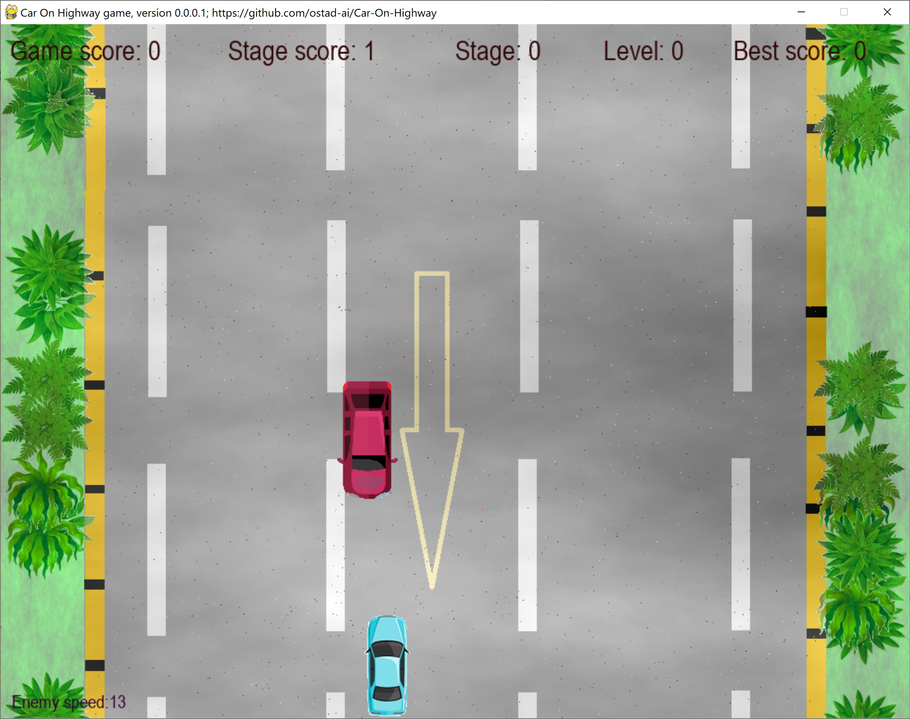
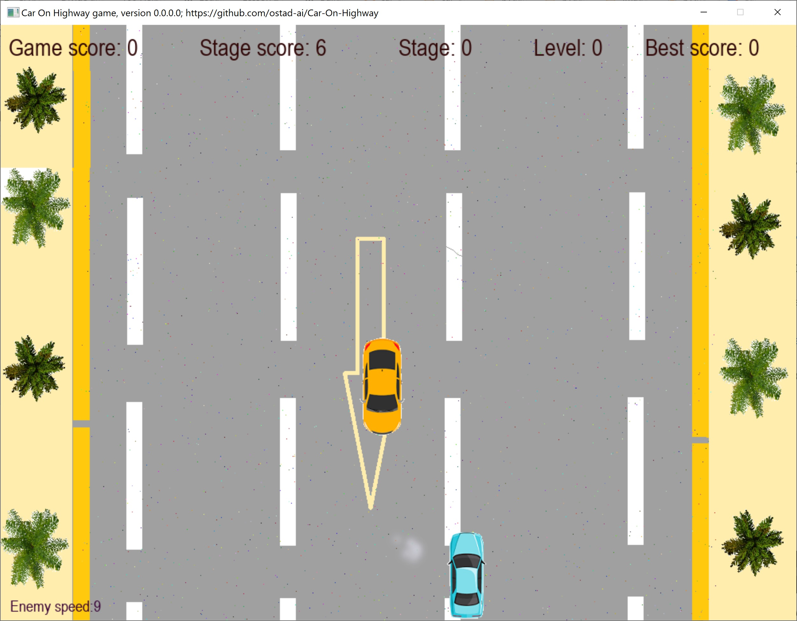

# CarOnHighway
### Newest: version 0.0.0.1
1. Textures for road and pavement have been added.
2. The sound of cars are included. 
3. Vegetation is done programatically. 
4. Music for menu and level changes are included. 
5. The number of cars have been increased.
6. Game logic has been modified.
**Hint:** To play with best performance, keep the power connected to your system.
## This archive includes the executable program, caronhighway.exe, which you should click on to run. This executable is for **Windows 10** and above only.
[Download the archive for win64](https://drive.google.com/file/d/11oL8PClnb3OBZ96_aeJQMwZtt087h6Y1/view?usp=sharing)
---
 *Figure 1: A snapshot of Car-On-Highway, newest version, while playing the game.*
---
### Older version: 0.0.0.0
1. A 2D car crash game
---
 *Figure 2: A snapshot of Car-On-Highway while playing the game.*
---